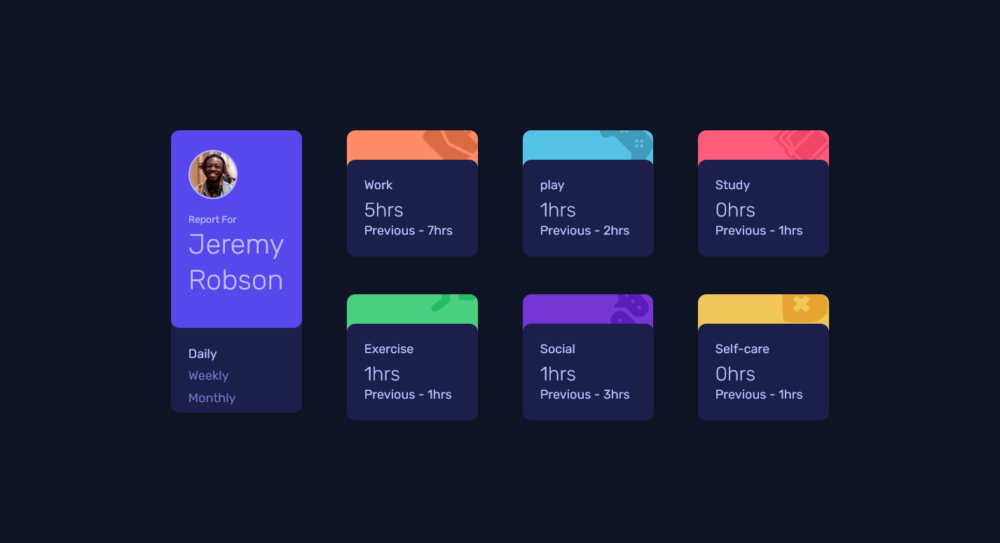

# Frontend Mentor - Time tracking dashboard solution

This is a solution to the [Time tracking dashboard challenge on Frontend Mentor](https://www.frontendmentor.io/challenges/time-tracking-dashboard-UIQ7167Jw). Frontend Mentor challenges help you improve your coding skills by building realistic projects. 

## Table of contents

- [Overview](#overview)
  - [The challenge](#the-challenge)
  - [Screenshot](#screenshot)
  - [Links](#links)
- [My process](#my-process)
  - [Built with](#built-with)
  - [What I learned](#what-i-learned)
  - [Continued development](#continued-development)


## Overview

### The challenge

Users should be able to:

- View the optimal layout for the site depending on their device's screen size
- See hover states for all interactive elements on the page
- Switch between viewing Daily, Weekly, and Monthly stats

### Screenshot




### Links

- Solution URL: [Git Repo Link](https://github.com/qayoommunawar/time-tracking-dashobard)
- Live Site URL: [Live Site Demo](https://qayoommunawar.github.io/time-tracking-dashobard/)

## My process

### Built with

- Semantic HTML5 markup
- CSS custom properties
- Flexbox
- CSS Grid
- Mobile-first workflow
- Vanila Js 


### What I learned

Worked with Jason files for the very first time, it was fun doing and i learnt a lot of things.

```js
fetch('data.json')
  .then(res => res.json())
  .then(data => {

    function render(timeframe) {
      data.forEach(item => {
        const className = item.title.toLowerCase().replace(' ', '-');
        const card = document.querySelector(`.${className}`);

        if (card) {
          const hoursElem = card.querySelector('h2');
          const prevElem = card.querySelector('.last-date');

          hoursElem.textContent = `${item.timeframes[timeframe].current}hrs`;
          prevElem.textContent = `Previous - ${item.timeframes[timeframe].previous}hrs`;
        }
      });
    }


    dailyBtn.addEventListener('click', () => render('daily'));
    weeklyBtn.addEventListener('click', () => render('weekly'));
    monthlyBtn.addEventListener('click', () => render('monthly'));

    render('daily');
  })
  .catch(err => console.error('Error loading data:', err));
```


### Continued development

Would love to make the design similar to the original in case of dashobard cards. for now i used background property 
css style  as follows:
```CSS
  .routine-cards .self-care{
  background: url('images/icon-self-care.svg');
  background-color: var(--clr-selfcare-card);
  }
  
  .routine-cards .bg-card{
    border-radius: var(--border-radius);
    background-position: 100% -25%;
    background-repeat: no-repeat;
    max-width: 320px;
    width: 100%;
  } 

```

